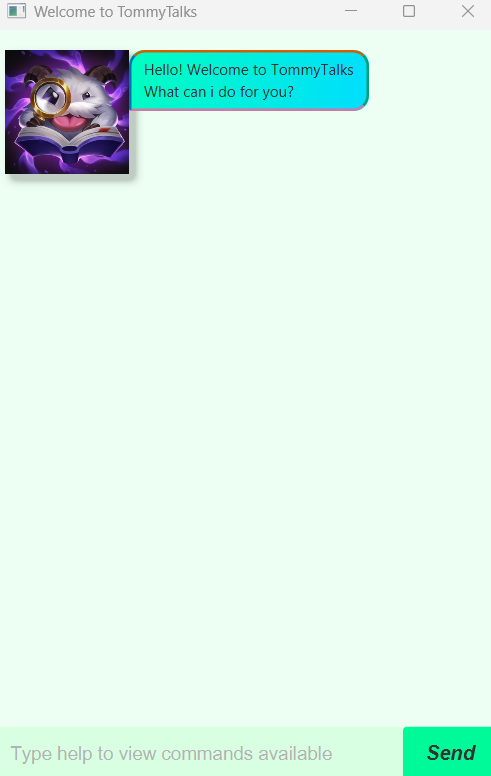

# TommyTalks Project

This was a project template for a greenfield Java project. It was named after the Java mascot _Duke_. 
I have adapted this project into TommyTalks. Given below are instructions on how to use it.

- [Setting Up](#quick-start)
- [Quick Start](#quick-start)
- [Tasks](#adding-tasks)
  - [ToDo](#todo)
  - [Deadline](#deadline)
  - [Event](#event)
- [Features](#features)
  - [List](#listing-all-tasks-list)
  - [Mark](#mark-as-completed-mark)
  - [Unmark](#unmark-a-task-unmark)
  - [Delete](#delete-a-task-delete)
  - [Find](#find-tasks-find)
  - [Help](#viewing-help-help)
  - [Priority](#set-the-priority-of-tasks-priority)
  - [Sort](#sort-the-tasks-sort)
  - [Bye](#exiting-the-program-bye)

## Setting up in Intellij

Prerequisites: JDK 17, update Intellij to the most recent version.

1. Open Intellij (if you are not in the welcome screen, click `File` > `Close Project` to close the existing project first)
1. Open the project into Intellij as follows:
   1. Click `Open`.
   1. Select the project directory, and click `OK`.
   1. If there are any further prompts, accept the defaults.
1. Configure the project to use **JDK 17** (not other versions) as explained in [here](https://www.jetbrains.com/help/idea/sdk.html#set-up-jdk).<br>
   In the same dialog, set the **Project language level** field to the `SDK default` option.
1. After that, locate the `src/main/java/tommyTalks/Tommytalks.java` file, right-click it, and choose `Run TommyTalks.main()` (if the code editor is showing compile errors, try restarting the IDE). If the setup is correct, you should see something like the below as the output:

2. You may see some warnings appear in the terminal however it is safe to ignore them.\

   **Warning:** Keep the `src\main\java` folder as the root folder for Java files (i.e., don't rename those folders or move Java files to another folder outside of this folder path), as this is the default location some tools (e.g., Gradle) expect to find Java files.
---
## Quick Start

1. Ensure you have Java 17 or above installed on your on your computer\
**MAC Users:** Ensure you have the precise JDK version prescribed [here](https://se-education.org/guides/tutorials/javaInstallationMac.html)
2. Download the latest `.jar` file from [here](https://github.com/Timothy-Ho0203/ip/releases)
3. Copy the file to the folder you want to use as the *home folder* for TommyTalks
4. Open a command terminal, `cd` into the folder you put the jar file in, and use the `java -jar TommyTalks.jar`
command to run the application.\
A GUI similar to above should appear in a few seconds.
5. Type the command in the command box and press Enter to execute it e.g. typing `help` and pressing Enter will
list out the possible commands. 
6. Refer to the [Features](#features) below for details of each command.

---

## Adding tasks
TommyTalks supports 3 kinds of tasks:

- **ToDo**
- **Deadline**
- **Event**

### ToDo

The simplest of all tasks, just give it a name and Tommy will keep track of it for you.

Format: `todo NAME`
- `NAME` is a string

Upon successful creation, you should expect to see the following output:

```
Added:
1. [T][] NAME
You have 1 tasks in the list.
```

### Deadline

A task that contains a deadline by which you aim to finish this task by.

Format: `deadline NAME /by DATE`
- `NAME` is a string
- `DATE` is in DD MM YYYY format

Upon successful creation, you should expect to see the following output:

```
Added:
1. [D][] NAME (by: DATE)
You have 1 tasks in the list.
```

### Event

A task that spans over a duration of time, with a start and end date.

Format: `event NAME /from START_DAY START_TIME /to END_DATE END_TIME`
- `NAME` is a string
- `START_DATE` and `END_DATE` is in DD MM YYYY format
- `START_TIME` and `END_TIME` is in 24 hours format as HH:MM

Upon successful creation, you should expect to see the following output:

```
Added:
1. [E][] NAME (from: START_DATE START_TIME to: END_DATE END_TIME)
You have 1 tasks in the list.
```

## Features

Tommy supports multiple features and commands that aim to make remembering and accessing tasks simple for you.

### Listing all tasks: `list`

Lists out all the tasks that you currently have in the list as a 1-indexed list.

Format: `list`

You should see your tasks listed out in a 1-indexed list:

```
Here are the tasks you have:
1. [T][] NAME
.
.
.
```

### Mark as completed: `mark`

Marks the specified task as completed, which is represented by an 'X' in
the second bracket.

Format: `mark INDEX`
- Marks the task at `INDEX` as completed
- `INDEX` refers to the index number shown in the displayed list of tasks
- `INDEX` must be a positive integer 1, 2, 3, ...

You should see a confirmation message upon successfully marking a task as completed:

```
Great! I'll mark this as done then.
1. [T][X] NAME
```

### Unmark a task: `unmark`

Marks the specified task as uncompleted, which is represented by an empty
second bracket.

Format: `unmark INDEX`
- Marks the task at `INDEX` as uncompleted
- `INDEX` refers to the index number shown in the displayed list of tasks
- `INDEX` must be a positive integer 1, 2, 3, ...

You should see a confirmation message upon successfully unmarking a task as completed:

```
Okay, I'll mark this as uncompleted.
1. [T][] NAME
```

### Delete a task: `delete`

Delete the specified task from the list of tasks.

Format: `delete INDEX`
- Deletes the task at `INDEX`
- `INDEX` refers to the index number shown in the displayed list of tasks
- `INDEX` must be a positive integer 1, 2, 3, ...

You should see a confirmation message upon successfully deleting a task:

```
Removed:
[T][] NAME
Now, you have (remaining number of tasks) tasks in the list.
```

### Find task(s): `find`

Lists all tasks whose names contain any of the given keywords.

Format: `find KEYWORD`
- The search is case-insensitive
- Only the name of the task is searched
- `KEYWORD` need not be a full word for a match e.g. `pro` will match `project`

You should see a confirmation message upon a successful query:

```
Are these what you're looking for?
1. [T][] NAME
.
.
.
```

### Viewing help: `help`

Shows a summary of possible commands explaining how to use the program.

Format: `help`

You should see a summary message for your query:

```
------------------------------------
Here is the list of commands
------------------------------------
.
.
.
```
### Set the priority of tasks: `priority`

Adjusts the priority of the specified task according to the priority specified.

Format: `priority INDEX PRIORITY`
- Adjusts the priority of the task at `INDEX`
- `INDEX` refers to the index number shown in the displayed list of tasks
- `INDEX` and `PRIORITY` must be a positive integer 1, 2, 3, ...
- A smaller integer indicates a higher priority e.g. 2 is a higher priority than 4

You should see a confirmation message upon successfully adjusting the priority:

```
I have adjusted the following priority:
[T][] NAME
Please call sort to view your new list.
```

### Sort the tasks: `sort`

Sort the list according to the priority levels of the tasks.

Format: `sort`
- Ordering is based on priority level, a higher priority will be at the start of the list
- Ties are broken lexicographically

You should see your tasks listed out in a new 1-indexed list:

```
Here are the tasks you have:
1. [T][] NAME
.
.
.
```

### Exiting the program: `bye`

Exits the program. Tommy will remember your tasks the next time you open up
the chat again.

Format: `bye`

You should see a goodbye message from Tommy after calling bye:

```
Bye, hope to see you again!
```


---


