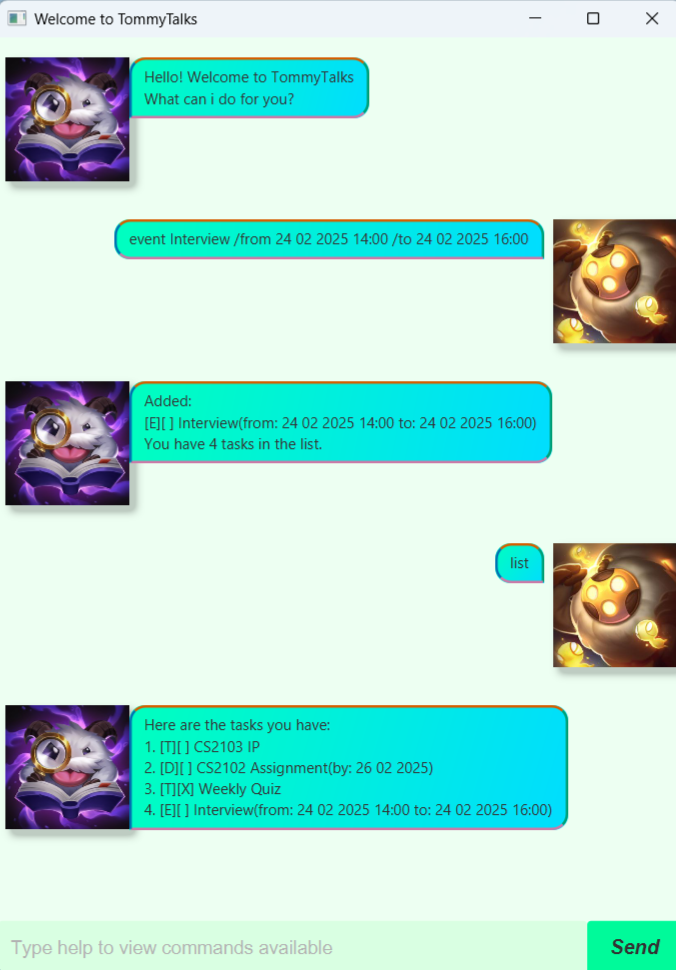

# tommyTalks User Guide



Ever wondered if there was an easier way to keep track of your tasks?\
Look no further, introducing **Tommy** - _your one-stop task manager_\
**Add**, **delete** and **sort** your tasks according to their priorities, and keep
track of their completion status all in one place!
---

## Adding tasks
TommyTalks supports 3 kinds of tasks:

- **ToDo**
- **Deadline**
- **Event**

### ToDo

The simplest of all tasks, just give it a name and Tommy will keep track of it for you.

Format: `todo NAME`
- `NAME` is a string

Upon successful creation, you should expect to see the following output:

```
Added:
1. [T][] NAME
You have 1 tasks in the list.
```

### Deadline

A task that contains a deadline by which you aim to finish this task by.

Format: `deadline NAME /by DATE`
- `NAME` is a string
- `DATE` is in DD MM YYYY format

Upon successful creation, you should expect to see the following output:

```
Added:
1. [D][] NAME (by: DATE)
You have 1 tasks in the list.
```

### Event

A task that spans over a duration of time, with a start and end date.

Format: `event NAME /from START_DAY START_TIME /to END_DATE END_TIME`
- `NAME` is a string
- `START_DATE` and `END_DATE` is in DD MM YYYY format
- `START_TIME` and `END_TIME` is in 24 hours format as HH:MM

Upon successful creation, you should expect to see the following output:

```
Added:
1. [E][] NAME (from: START_DATE START_TIME to: END_DATE END_TIME)
You have 1 tasks in the list.
```

## Features

Tommy supports multiple features and commands that aim to make remembering and accessing tasks simple for you.

### Listing all tasks: `list`

Lists out all the tasks that you currently have in the list as a 1-indexed list.

Format: `list`

You should see your tasks listed out in a 1-indexed list:

```
Here are the tasks you have:
1. [T][] NAME
.
.
.
```

### Mark as completed: `mark`

Marks the specified task as completed, which is represented by an 'X' in
the second bracket.

Format: `mark INDEX`
- Marks the task at `INDEX` as completed
- `INDEX` refers to the index number shown in the displayed list of tasks
- `INDEX` must be a positive integer 1, 2, 3, ...

You should see a confirmation message upon successfully marking a task as completed:

```
Great! I'll mark this as done then.
1. [T][X] NAME
```

### Unmark a task: `unmark`

Marks the specified task as uncompleted, which is represented by an empty 
second bracket.

Format: `unmark INDEX`
- Marks the task at `INDEX` as uncompleted
- `INDEX` refers to the index number shown in the displayed list of tasks
- `INDEX` must be a positive integer 1, 2, 3, ...

You should see a confirmation message upon successfully unmarking a task as completed:

```
Okay, I'll mark this as uncompleted.
1. [T][] NAME
```

### Delete a task: `delete`

Delete the specified task from the list of tasks. 

Format: `delete INDEX`
- Deletes the task at `INDEX`
- `INDEX` refers to the index number shown in the displayed list of tasks
- `INDEX` must be a positive integer 1, 2, 3, ...

You should see a confirmation message upon successfully deleting a task:

```
Removed:
[T][] NAME
Now, you have (remaining number of tasks) tasks in the list.
```

### Find task(s): `find`

Lists all tasks whose names contain any of the given keywords.

Format: `find KEYWORD`
- The search is case-insensitive
- Only the name of the task is searched
- `KEYWORD` need not be a full word for a match e.g. `pro` will match `project`

You should see a confirmation message upon a successful query:

```
Are these what you're looking for?
1. [T][] NAME
.
.
.
```

### Viewing help: `help`

Shows a summary of possible commands explaining how to use the program.

Format: `help`

You should see a summary message for your query:

```
------------------------------------
Here is the list of commands
------------------------------------
.
.
.
```
### Set the priority of tasks: `priority`

Adjusts the priority of the specified task according to the priority specified.

Format: `priority INDEX PRIORITY`
- Adjusts the priority of the task at `INDEX`
- `INDEX` refers to the index number shown in the displayed list of tasks
- `INDEX` and `PRIORITY` must be a positive integer 1, 2, 3, ...
- A smaller integer indicates a higher priority e.g. 2 is a higher priority than 4

You should see a confirmation message upon successfully adjusting the priority:

```
I have adjusted the following priority:
[T][] NAME
Please call sort to view your new list.
```

### Sort the tasks: `sort`

Sort the list according to the priority levels of the tasks.

Format: `sort`
- Ordering is based on priority level, a higher priority will be at the start of the list
- Ties are broken lexicographically

You should see your tasks listed out in a new 1-indexed list:

```
Here are the tasks you have:
1. [T][] NAME
.
.
.
```

### Exiting the program: `bye`

Exits the program. Tommy will remember your tasks the next time you open up
the chat again.

Format: `bye`

You should see a goodbye message from Tommy after calling bye:

```
Bye, hope to see you again!
```


---
## Summary

For a quick reference, TommyTalks supports 3 kinds of tasks:
1. [ToDo](#todo)
2. [Deadline](#deadline)
3. [Event](#event)

TommyTalks has the following commands you can call:
1. [List](#listing-all-tasks-list)
2. [Mark](#mark-as-completed-mark)
3. [Unmark](#unmark-a-task-unmark)
4. [Delete](#delete-a-task-delete)
5. [Find](#find-tasks-find)
6. [Help](#viewing-help-help)
7. [Priority](#set-the-priority-of-tasks-priority)
8. [Sort](#sort-the-tasks-sort)
9. [Bye](#exiting-the-program-bye)

This is Tommy's first time as a manager, so please be understanding and take good care of him!\
I hope you enjoy your time with Tommy!